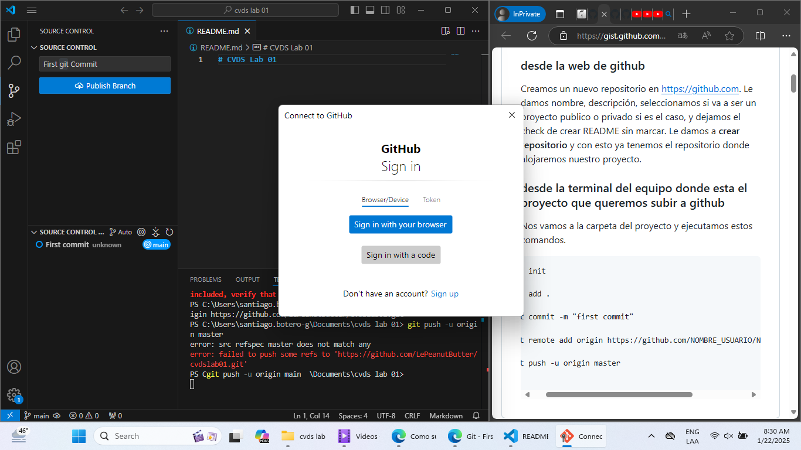
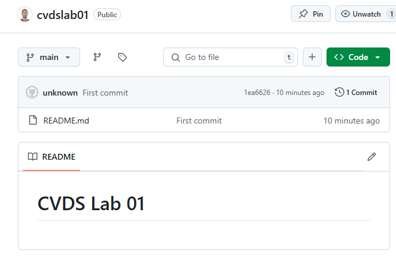

# CVDS Laboratorio 01
Este repositorio tiene como objetivo enlazar un repositorio Git local y servir como práctica para el uso de control de versiones.

## Parte I (Trabajo individual)
Se creó un repositorio local en Git utilizando Visual Studio Code.

Para este ejercicio, se generó el archivo README.md y se enlazó con un repositorio vacío en GitHub.

Se verificó que el push fue exitoso, por lo que ahora se están realizando ediciones en el README.md con los nuevos cambios.
