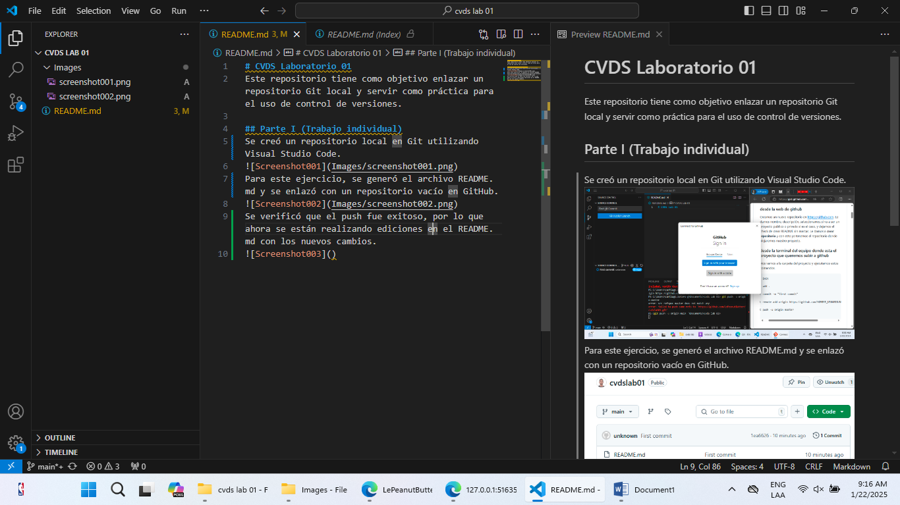

# CVDS Laboratorio 01
Este repositorio tiene como objetivo enlazar un repositorio Git local y servir como práctica para el uso de control de versiones.

## Parte I (Trabajo individual)
Se creó un repositorio local en Git utilizando Visual Studio Code.

Para este ejercicio, se generó el archivo README.md y se enlazó con un repositorio vacío en GitHub.

El comando git add prepara los archivos modificados para ser incluidos en el siguiente commit, añadiéndolos al área de preparación. Luego, git commit -m "mensaje" guarda esos cambios en el historial del repositorio con un mensaje descriptivo. Ambos comandos son esenciales para registrar y organizar los cambios en un proyecto Git. Despues de esto, se verificó que el push fuese exitoso. Por lo que ahora se están realizando ediciones en el README.md con nuevos cambios.
